# 组合风险系统详细操作说明书

文档版本：V1.0  
文档状态：正式操作稿  
编制日期：2026-07-23  
适用系统：组合风险系统  
访问地址：http://localhost:5173  
保密级别：内部使用

<!-- PAGEBREAK -->

## 文档控制

### 修订记录

| 版本 | 日期 | 修订内容 | 状态 |
| --- | --- | --- | --- |
| V1.0 | 2026-07-23 | 基于当前本地运行版本编制完整图文操作说明 | 正式操作稿 |

### 使用说明

本手册面向组合风险经理、信贷风险经理、模型管理员、数据治理人员、预警处置人员、审计人员和系统管理员。截图使用本地模拟数据，页面指标会随数据日期、计算批次、预警状态和用户权限变化。

不同角色看到的菜单和按钮可能不同。未显示某个菜单或按钮时，应先确认当前用户是否拥有对应权限，不应通过修改浏览器地址绕过权限控制。

## 1. 系统登录

### 1.1 登录入口

使用浏览器访问 http://localhost:5173，系统进入登录页。

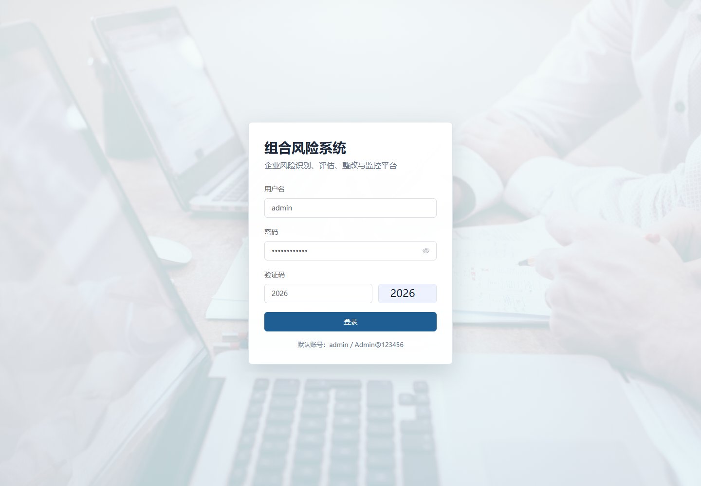

### 1.2 登录步骤

1. 在“用户名”输入框输入账号。
2. 在“密码”输入框输入密码。
3. 在“验证码”输入框输入右侧图片中的验证码。
4. 单击“登录”。
5. 登录成功后进入“风险总览”。

系统不提供默认密码。管理员账号由部署人员通过 `BOOTSTRAP_ADMIN_PASSWORD_HASH` 安全初始化，用户必须使用正式分配的账号和密码。

### 1.3 登录异常

| 提示或现象 | 原因 | 处理方法 |
| --- | --- | --- |
| 用户名或密码错误 | 账号或密码不正确 | 重新输入，必要时联系管理员重置 |
| 验证码错误 | 验证码已变化或输入错误 | 刷新验证码后重新输入 |
| session expired | 登录会话已过期 | 返回登录页重新登录 |
| invalid token | 令牌无效或系统密钥已更新 | 清除浏览器会话并重新登录 |
| 页面一直加载 | 网关或后端服务不可用 | 联系运维检查服务状态 |

## 2. 主界面与导航

登录后页面由左侧菜单、顶部工具栏和主工作区组成。

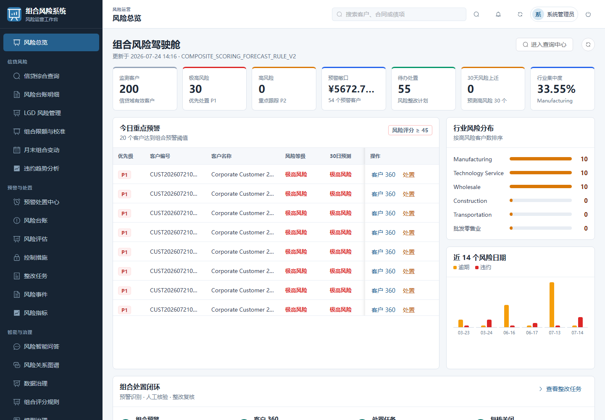

### 2.1 左侧菜单

| 菜单分组 | 主要用途 |
| --- | --- |
| 信贷风险 | 信贷查询、风险台账、LGD、组合限额和违约趋势 |
| 预警与处置 | 预警案件、风险台账、评估、控制、整改、事件和指标 |
| 智能与治理 | AI、关系图谱、数据治理、评分、模型、订阅和报表 |
| 系统管理 | 用户、角色、部门、岗位、租户、日志、通知和参数 |

### 2.2 顶部工具栏

- 全局搜索：输入客户编号、合同编号或债项编号后进入信贷查询中心。
- 放大镜按钮：打开查询中心。
- 铃铛按钮：进入风险通知。
- 刷新按钮：刷新当前用户资料和权限。
- 用户区域：显示当前登录用户。
- 退出按钮：安全退出系统。

### 2.3 状态颜色

| 颜色 | 一般含义 |
| --- | --- |
| 红色 | 极高风险、超限、逾期或需要立即处置 |
| 橙色 | 关注、预警、部分有效或接近阈值 |
| 绿色 | 正常、通过、有效或已完成 |
| 蓝色 | 信息、处理中或当前选择 |
| 灰色 | 停用、观察中、无数据或只读 |

## 3. 风险总览

入口：左侧“风险总览”。

风险总览用于每天进入系统后的第一轮组合检查。

### 3.1 核心指标

页面顶部显示：

- 监测客户：纳入组合评分的有效客户数。
- 极高风险：优先级为 P1 的客户数。
- 高风险：需要重点跟踪的 P2 客户数。
- 预警敞口：预警客户对应的风险敞口。
- 待办处置：未完成的风险整改任务。
- 30 天风险上迁：预测风险等级可能上升的客户。
- 行业集中度：当前风险客户最多或敞口集中的行业。

### 3.2 今日重点预警

表格按照优先级和风险评分排列。可查看客户编号、名称、风险等级和 30 天预测。

操作建议：

1. 优先查看 P1 和红色风险客户。
2. 单击“客户 360”进入客户综合视图。
3. 单击“处置”生成或进入预警整改流程。
4. 对预测风险上迁但尚未违约的客户提前采取措施。

### 3.3 行业与日期图表

行业风险分布用于识别风险客户集中行业；近 14 个风险日期用于观察逾期和违约变化。柱状图反映每日数量，不应与存量风险客户数直接相加。

### 3.4 刷新数据

单击右上角刷新按钮重新加载看板。刷新不会自动重新计算全部模型；需要生成计算批次时，应前往对应专业页面执行。

## 4. 信贷综合查询

入口：信贷风险 → 信贷综合查询。

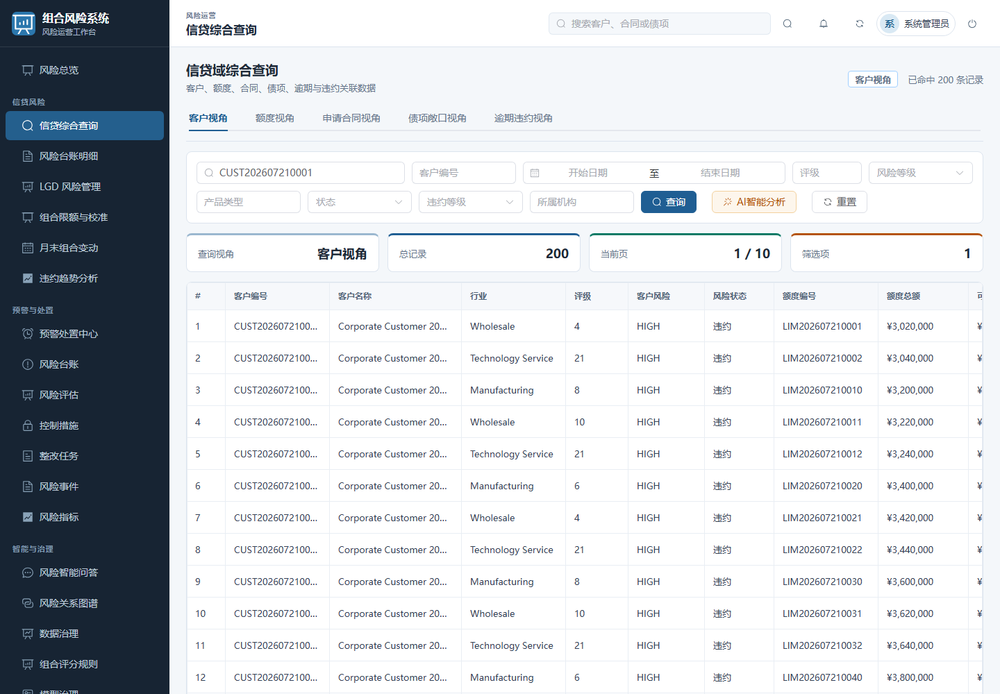

### 4.1 查询视角

| 视角 | 查询对象 |
| --- | --- |
| 客户视角 | 客户、评级、额度和整体风险 |
| 额度视角 | 额度总额、已用、可用、期限和状态 |
| 申请合同视角 | 业务申请与合同的对应关系 |
| 债项敞口视角 | 支用、债项、EAD、PD、LGD 和 EL |
| 逾期违约视角 | 逾期、债项违约和客户违约 |

### 4.2 查询步骤

1. 选择查询视角。
2. 在“综合关键字”输入客户名称、客户编号、合同编号或债项编号。
3. 根据需要填写客户编号、日期范围、评级、风险等级、产品、状态、违约等级和所属机构。
4. 单击“查询”。
5. 查看查询摘要中的总记录、当前页和筛选项数量。
6. 在结果表中查看明细。

查询条件可以组合。条件越多，结果范围越小。未填写日期时，系统按当前查询视角返回全部可访问数据。

### 4.3 客户下钻

单击客户记录可进入客户分析入口。客户 360 应重点核对：

- 客户基本信息和归属机构。
- 当前有效评级和额度。
- 申请、合同和债项关系。
- 押品覆盖情况。
- EAD、PD、LGD、EL。
- 逾期和违约证据。
- 预警案件与整改状态。

### 4.4 AI 智能分析

单击“AI智能分析”，输入客户编号或名称，选择是否查询外部数据，然后单击“开始分析”。该入口与“风险智能问答”使用同一客户风险数据，但结果展示更偏向当前查询上下文。

### 4.5 数据时间轴

业务时间轴应按照业务申请、合同、债项支用、风险敞口、逾期和违约顺序显示。同日事件按业务顺序排列。若发现支用早于合同、逾期早于支用，应提交数据质量问题。

## 5. 风险台账明细

入口：信贷风险 → 风险台账明细。

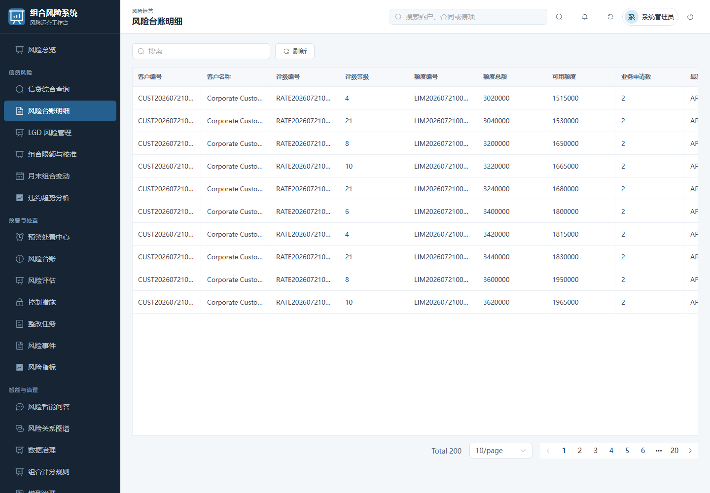

### 5.1 台账用途

风险台账按客户汇总信贷域 12 张核心表的数据，用于快速判断一个客户的业务规模、风险暴露和违约状态。

### 5.2 主要字段

| 字段 | 说明 |
| --- | --- |
| 客户编号、客户名称 | 客户唯一识别信息 |
| 评级编号、评级等级 | 当前有效评级 |
| 额度编号、额度总额、可用额度 | 当前有效额度 |
| 申请数、合同数、支用数 | 客户业务数量 |
| 未结本金、敞口余额 | 当前风险规模 |
| 押品数、担保金额 | 风险缓释情况 |
| 逾期数、最大逾期天数 | 逾期严重程度 |
| 债项违约数、最高违约等级 | 债项违约情况 |
| 客户违约状态 | 客户层汇总违约 |
| 台账风险等级 | 综合风险判断 |

### 5.3 使用方法

1. 使用客户编号或名称筛选。
2. 按风险等级、逾期天数或敞口金额排序。
3. 对高风险客户核对评级、额度、债项、押品和违约信息。
4. 通过关联预警案件进入处置。
5. 导出前确认当前筛选条件和数据日期。

## 6. 违约趋势分析

入口：信贷风险 → 违约趋势分析。

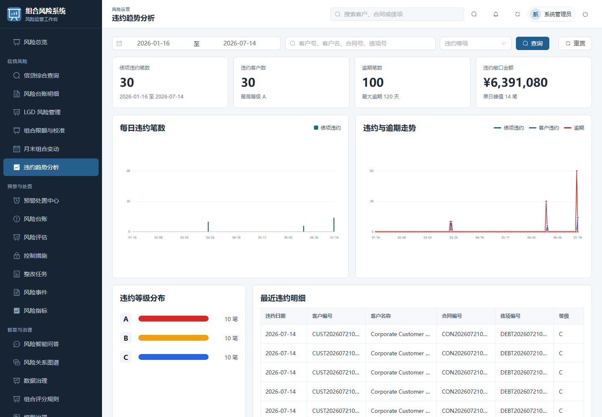

### 6.1 页面用途

违约趋势用于按时间观察新增逾期、债项违约和客户违约，支持识别风险集中出现的日期、行业、产品和机构。

### 6.2 操作步骤

1. 选择开始日期和结束日期。
2. 选择需要的行业、产品、机构或客户条件。
3. 单击查询或刷新。
4. 查看柱状图中的每日新增数量。
5. 查看折线趋势中的变化方向。
6. 下钻查看当日风险明细。

### 6.3 口径说明

- 每日新增表示当日新发生记录，不等于当前存量。
- 逾期日期需要结合宽限期和法定节假日判断。
- 债项违约与客户违约数量不同，一个客户可能有多笔违约债项。

## 7. LGD 风险管理

入口：信贷风险 → LGD 风险管理。

### 7.1 LGD 总览

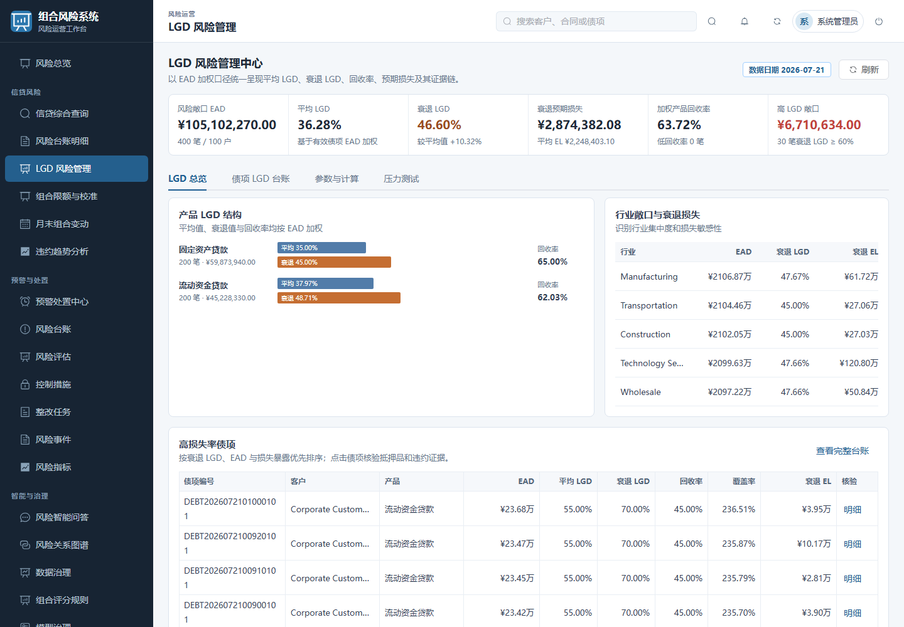

顶部指标包括风险敞口 EAD、平均 LGD、衰退 LGD、衰退预期损失、加权产品回收率和高 LGD 敞口。

重点判断：

- 衰退 LGD 是否明显高于平均 LGD。
- 高 LGD 敞口是否集中在少数客户或行业。
- 产品回收率下降是否推高预期损失。
- 押品覆盖率是否足以解释较低 LGD。

产品 LGD 结构图显示平均值、衰退值和回收率。行业表按 EAD 和衰退损失展示损失敏感性。

### 7.2 债项 LGD 台账

单击“债项 LGD 台账”页签。

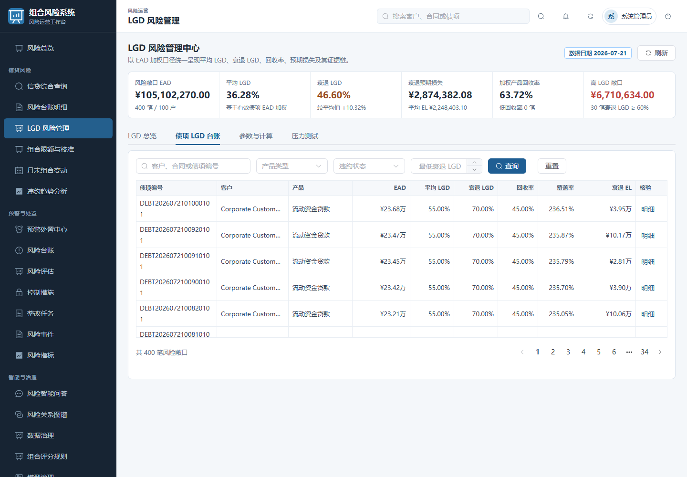

操作步骤：

1. 输入客户、合同或债项编号。
2. 选择产品类型。
3. 选择已违约或未违约。
4. 设置最低衰退 LGD。
5. 单击“查询”。
6. 查看 EAD、平均 LGD、衰退 LGD、回收率、覆盖率和衰退 EL。
7. 单击“明细”核对押品、逾期和违约证据。

### 7.3 参数与计算

“参数与计算”页签用于模型管理人员查看：

- 当前发布的 LGD 模型版本。
- 不同产品或风险分段的 LGD 参数。
- 回收率和押品折减参数。
- 历史计算批次。

单击“生成计算快照”会对当前有效敞口固化计算结果。执行前应确认数据日期、模型版本和参数均正确。

### 7.4 压力测试

“压力测试”页签支持抵押品价值折减、回收周期延长和行业回收率下调等情景。

操作步骤：

1. 选择压力情景。
2. 单击“运行测试”。
3. 比较基准与压力下的衰退 LGD。
4. 比较衰退 EL 增量和高 LGD 债项变化。
5. 查看影响最大的债项样本。

压力测试不会覆盖正式 LGD 参数和风险敞口。

## 8. 组合限额与校准

入口：信贷风险 → 组合限额与校准。

### 8.1 集中度与限额

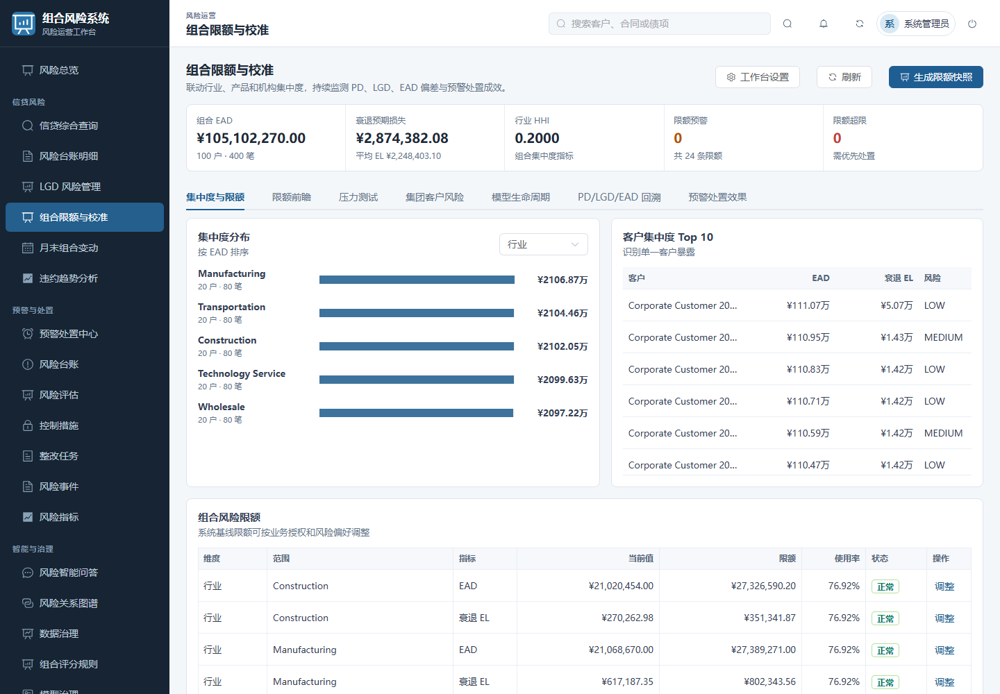

页面顶部显示组合 EAD、衰退预期损失、行业 HHI、限额预警和限额超限数量。

集中度操作：

1. 在集中度分布右上角选择行业、产品或机构。
2. 查看各分组 EAD 排名。
3. 查看客户集中度 Top 10。
4. 对单一客户或行业暴露过高的情况进行下钻。

限额状态：

| 状态 | 判断 |
| --- | --- |
| 正常 | 使用率低于预警比例 |
| 预警 | 使用率达到预警比例但未超过 100% |
| 超限 | 使用率超过 100% |
| 停用 | 限额定义已停用 |

### 8.2 调整限额

1. 在“组合风险限额”表找到目标行业、产品或机构。
2. 单击“调整”。
3. 修改限额、预警比例、责任人或启用状态。
4. 单击“保存”。
5. 检查新使用率和监测状态。

限额调整属于重要风险操作，应按授权执行。预警比例必须大于 0 且不超过 100%。

### 8.3 生成限额快照

单击右上角“生成限额快照”，系统保存当前数据日期下各限额的实际值、利用率、集中度和状态。同一限额同一日期重复执行会更新当前快照，不会重复生成多条。

### 8.4 PD/LGD/EAD 回溯

单击“PD/LGD/EAD 回溯”页签。

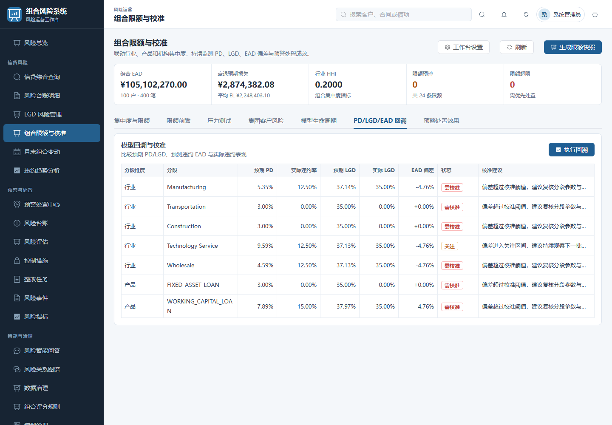

单击“执行回溯”后，系统按行业和产品比较：

- 预期 PD 与实际违约率。
- 预期 LGD 与实际 LGD。
- 预测违约 EAD 与实际违约暴露。
- 预测 EL 与实际损失。

状态说明：

| 状态 | 处理建议 |
| --- | --- |
| 稳定 | 参数表现处于正常区间，继续监控 |
| 关注 | 偏差进入关注区间，观察下一批结果 |
| 需校准 | 偏差超过阈值，复核样本和参数并发起模型调整 |

执行回溯会生成新的批次记录。模型管理员应记录异常分段、原因分析和后续动作。

### 8.5 预警处置效果

单击“预警处置效果”页签。

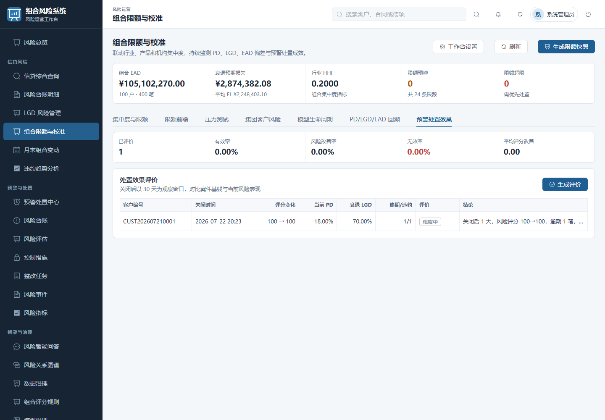

单击“生成评价”，系统对已关闭案件比较关闭时风险评分与当前风险表现。

| 评价 | 含义 |
| --- | --- |
| 观察中 | 关闭后不足 30 天 |
| 有效 | 风险评分明显下降且无逾期、无违约 |
| 部分有效 | 风险下降但未满足全部有效条件 |
| 无效 | 风险未下降或继续恶化 |

无效或部分有效案件应重新评估措施，必要时重新立案、调整限额或复核模型。

## 9. 预警处置中心

入口：预警与处置 → 预警处置中心。

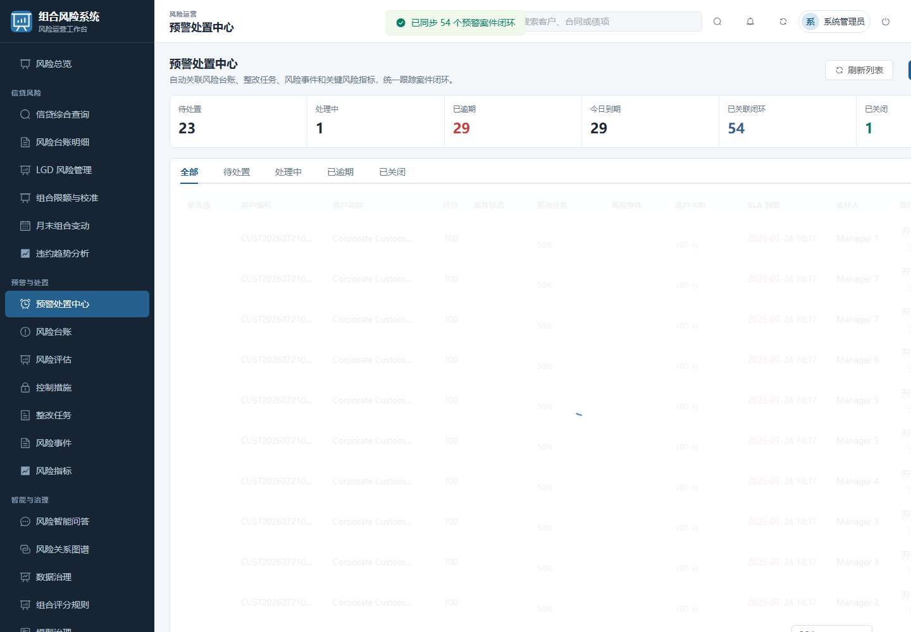

### 9.1 页面摘要

顶部显示待处置、处理中、已逾期、今日到期、已关联闭环和已关闭案件数量。

### 9.2 案件筛选

使用“全部、待处置、处理中、已逾期、已关闭”页签切换案件状态。列表显示优先级、客户、评分、整改任务、风险事件、客户 KRI、SLA、责任人和操作。

### 9.3 同步预警闭环

单击“同步预警闭环”，系统会：

1. 根据当前组合评分识别预警客户。
2. 新建或更新预警案件。
3. 关联风险台账。
4. 生成整改任务。
5. 同步风险事件和客户 KRI。
6. 更新案件摘要。

### 9.4 开始处置

1. 找到待处置或已逾期案件。
2. 单击“开始处置”。
3. 确认责任人、整改任务和 SLA。
4. 按任务要求开展客户核验、催收、限额冻结、押品复核等措施。
5. 在整改任务中更新进度。

### 9.5 关闭案件

1. 确认必要核验和整改已完成。
2. 单击“关闭案件”。
3. 填写风险核验和处置结论。
4. 提交关闭。
5. 检查整改任务、风险事件和 KRI 是否同步更新。
6. 案件进入 30 天效果观察。

不得在风险事实未核实、任务未完成或结论为空时关闭案件。

## 10. 风险智能问答

入口：智能与治理 → 风险智能问答。

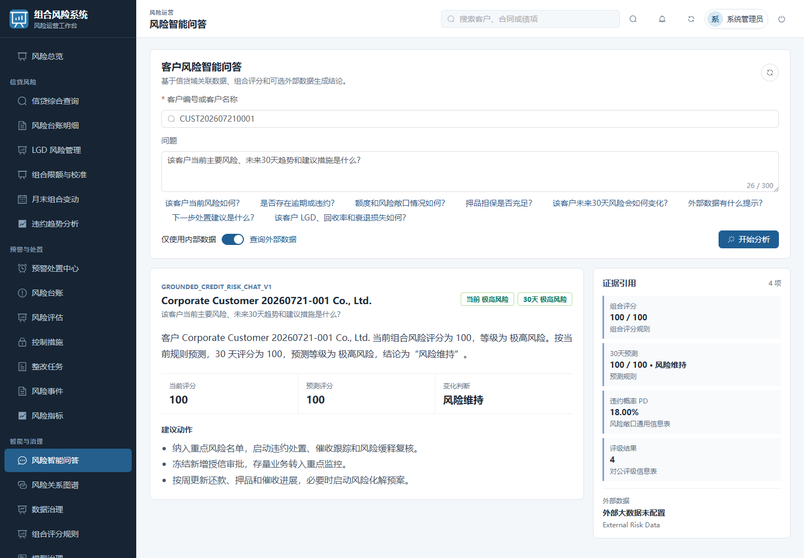

### 10.1 分析步骤

1. 输入客户编号或客户名称。
2. 输入问题，或选择页面提供的快捷问题。
3. 选择“仅使用内部数据”或“查询外部数据”。
4. 单击“开始分析”。
5. 查看风险评分、30 天预测、风险变化和建议动作。
6. 在右侧“证据引用”核对数据来源。

### 10.2 推荐问题

- 该客户当前风险如何？
- 是否存在逾期或违约？
- 额度和风险敞口情况如何？
- 押品担保是否充足？
- 未来 30 天风险会如何变化？
- 外部数据有什么提示？
- 下一步处置建议是什么？
- 该客户 LGD、回收率和衰退损失如何？

### 10.3 结果解释

AI 结果应同时包含：

- 当前风险等级和评分。
- 30 天预测评分与变化判断。
- 主要风险信号。
- 建议动作。
- 证据引用和来源表。
- 外部数据状态。

AI 分析是辅助结论，不代替授信审批、违约认定和案件关闭。外部数据不可用时，系统会继续使用内部数据并标记降级状态。

## 11. 数据治理

入口：智能与治理 → 数据治理。

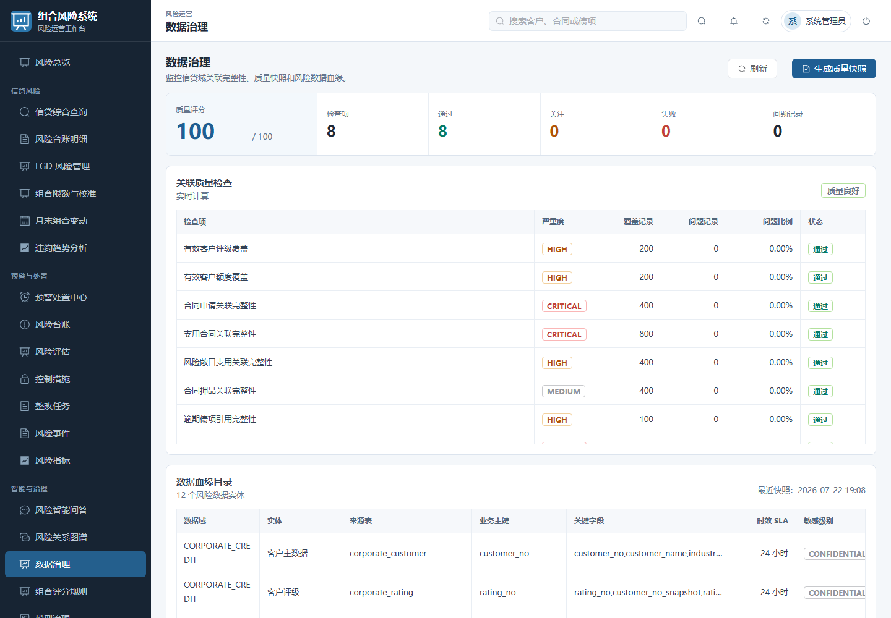

### 11.1 质量摘要

顶部显示质量评分、检查项、通过、关注、失败和问题记录。

### 11.2 生成质量快照

1. 单击“生成质量快照”。
2. 等待检查完成。
3. 查看每个检查项的严重度、覆盖记录、问题记录、问题比例和状态。
4. 对关注或失败项目下钻异常数据。
5. 修复数据后重新生成快照。

### 11.3 重点检查

- 有效客户评级覆盖。
- 有效客户额度覆盖。
- 合同与申请关联完整性。
- 支用与合同关联完整性。
- 风险敞口与支用关联完整性。
- 合同与押品关联完整性。
- 逾期债项引用完整性。
- 业务日期先后顺序。

### 11.4 数据血缘目录

血缘目录展示数据域、实体、来源表、业务主键、关键字段、时效 SLA 和敏感级别。数据异常时，应根据血缘从风险结果追溯到源业务表。

## 12. 组合评分规则

入口：智能与治理 → 组合评分规则。

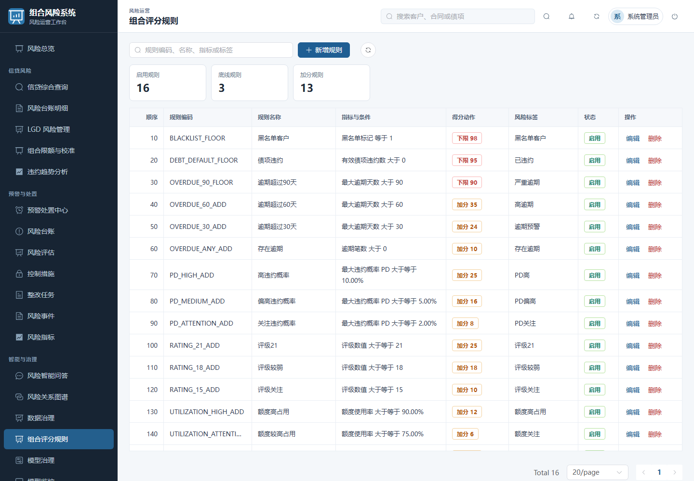

### 12.1 规则字段

| 字段 | 说明 |
| --- | --- |
| 规则编号 | 规则唯一标识 |
| 指标 | 逾期、违约、PD、额度使用率、覆盖率等 |
| 操作符 | 大于、大于等于、小于、小于等于、等于 |
| 阈值 | 触发规则的数值 |
| 动作 | ADD 累加分值或 FLOOR 设置最低分 |
| 分值 | 规则触发后的评分影响 |
| 风险标签 | 输出给看板、案件和 AI 的标签 |
| 启用状态 | 是否参与生产评分 |

### 12.2 操作注意

- 生产规则修改前应先在模型治理中创建草稿和模拟。
- 同一指标的 ADD 规则按引擎约束执行，避免重复累计。
- 高风险兜底规则应使用 FLOOR。
- 规则变更后检查风险客户数量和等级迁徙。
- 直接删除生产规则前必须完成影响评估。

## 13. 模型治理

入口：智能与治理 → 模型治理。

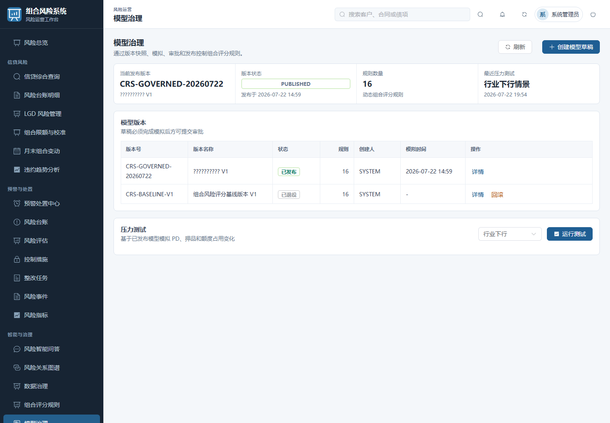

### 13.1 模型版本流程

创建草稿 → 调整规则 → 模拟 → 提交 → 审批 → 发布 → 监控 → 回滚或退役。

### 13.2 创建模型草稿

1. 单击“创建模型草稿”。
2. 输入版本号、版本名称和说明。
3. 保存草稿。
4. 打开详情调整规则。
5. 单击“模拟”查看客户评分影响。
6. 确认后提交审批。

### 13.3 发布与回滚

- 只有审批通过的版本可以发布。
- 同一模型同一时点只能有一个发布版本。
- 发布后应检查模型监控、预警客户和回溯结果。
- 新版本表现异常时，可对已退役版本执行回滚。

### 13.4 压力测试

选择行业下行、利率上行或押品折减，单击“运行测试”，比较当前评分、压力评分和变化。压力测试仅用于评估，不直接改变生产评分。

## 14. 模型监控

入口：智能与治理 → 模型监控。

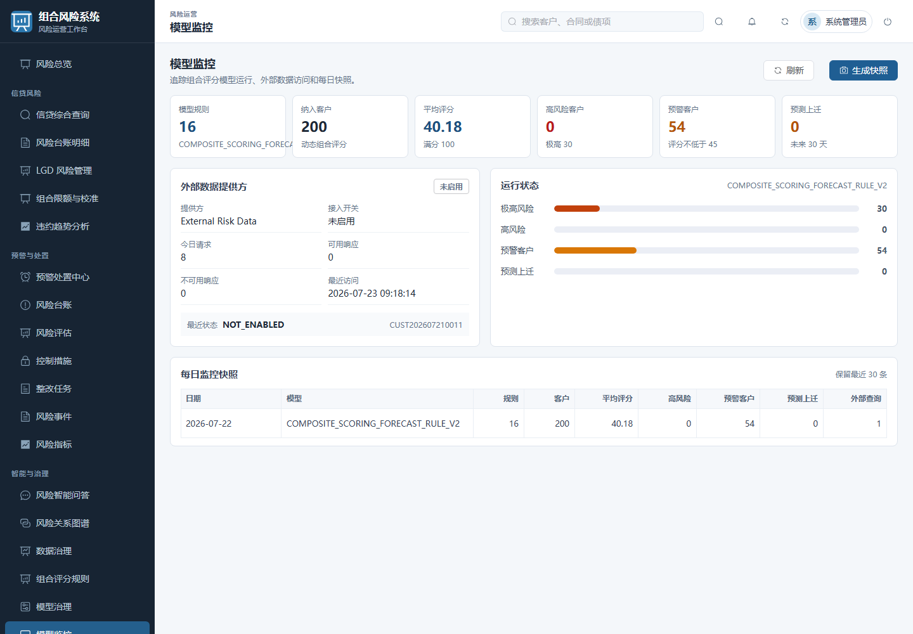

模型监控用于观察：

- 客户覆盖率。
- 平均风险评分。
- 高风险和极高风险占比。
- 评分分布变化。
- 模型运行日期和版本。
- 与上一快照的变化。

发现评分突然整体上升、覆盖客户大幅减少或分布异常时，应检查数据质量、规则版本和计算任务。

## 15. 预警订阅

入口：智能与治理 → 预警订阅。

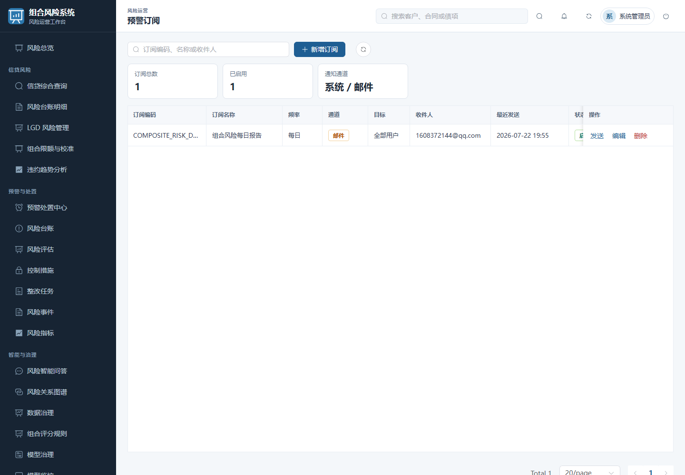

### 15.1 新建订阅

1. 单击新增。
2. 填写订阅名称。
3. 选择风险对象和触发条件。
4. 选择接收用户或角色。
5. 选择系统消息、邮件等渠道。
6. 启用订阅并保存。

### 15.2 手工分发

需要立即验证订阅时，可单击分发按钮。检查通知记录和邮件状态。MQ 或邮件不可用时，主风险数据不受影响，但应在通知和日志中处理失败记录。

## 16. 风险关系图谱

入口：智能与治理 → 风险关系图谱。

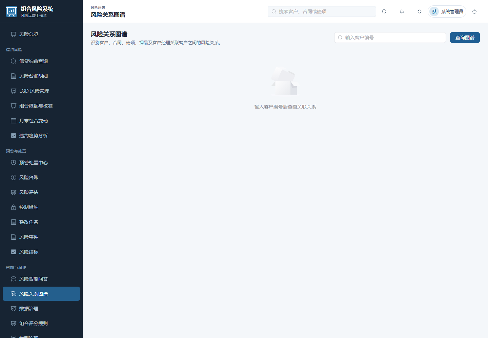

### 16.1 查询步骤

1. 输入客户编号。
2. 单击“查询图谱”。
3. 查看客户、额度、申请、合同、债项、押品、逾期、违约、案件和事件节点。
4. 单击节点查看编号、金额、日期和状态。
5. 沿客户—合同—债项—逾期—违约路径核验风险传播。

图谱节点较多时，应按对象类型或层级逐步展开，避免一次展示过多节点。

## 17. 管理报表

入口：智能与治理 → 管理报表。

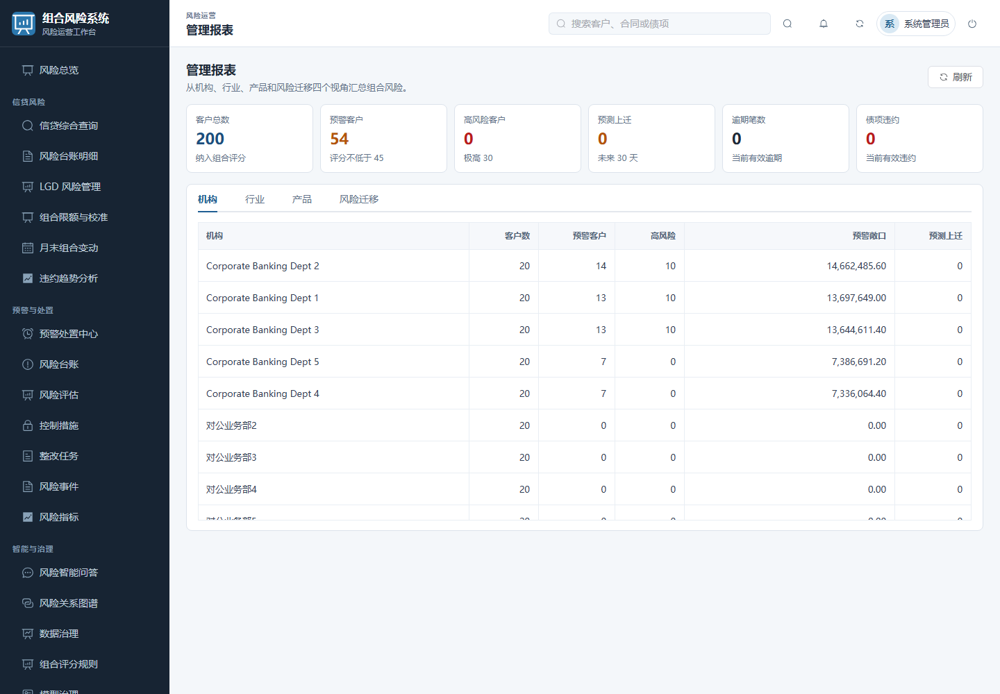

### 17.1 报表视角

| 页签 | 内容 |
| --- | --- |
| 机构 | 各机构客户、预警、高风险和风险敞口 |
| 行业 | 行业客户、风险和集中度 |
| 产品 | 产品 EAD、EL、PD 和 LGD |
| 风险迁移 | 等级变化和风险上迁 |

### 17.2 使用方法

1. 单击对应页签切换分析视角。
2. 检查顶部客户、预警、高风险、上迁、逾期和违约指标。
3. 按风险敞口或高风险数量排序。
4. 下钻到客户或业务明细。
5. 导出前确认数据日期和筛选范围。

## 18. 通用预警与处置目录

### 18.1 风险台账

记录风险编号、名称、分类、等级、责任部门、责任人、状态、识别日期和整改期限。信贷预警自动生成的台账应通过案件关联查看，不要重复人工新建同一风险。

### 18.2 风险评估

录入发生可能性、影响程度、固有风险、剩余风险、评估人、日期和结论。评估结果应与控制措施和整改任务对应。

### 18.3 控制措施

维护预防性、发现性和纠正性控制，设置执行频率、责任人、有效性和状态。

### 18.4 整改任务

维护整改动作、责任人、截止日期、进度和状态。预警案件启动后系统会自动生成任务，处置人员应持续更新进度。

### 18.5 风险事件

记录事件严重程度、发生时间、损失金额、责任人和处理状态。预警案件关闭后，关联事件进入复盘或关闭状态。

### 18.6 风险指标

维护指标阈值、当前值、趋势、责任人和状态。案件闭环中的客户 KRI 会随案件和风险变化同步。

## 19. 系统管理

### 19.1 用户与角色

系统管理员可维护用户、角色、部门、岗位和权限。角色变更后，用户重新加载资料或重新登录即可获得新权限。

### 19.2 风险参数

风险参数用于管理阈值和业务配置。修改前应确认参数用途、单位、作用范围和是否支持动态生效。

### 19.3 通知

通知支持系统、邮件和短信渠道定义。生产环境的实际渠道由 Apollo 和运行配置控制。

### 19.4 日志

| 日志 | 用途 |
| --- | --- |
| 登录日志 | 查询登录成功、失败和账号异常 |
| 操作日志 | 查询限额、模型、案件等操作 |
| 错误日志 | 查询接口错误和请求标识 |
| 外部访问日志 | 查询外部风险数据调用 |
| 模型审批日志 | 查询模型提交、审批、发布和回滚 |

## 20. 推荐日常操作流程

### 20.1 每日风险经理

1. 登录后查看风险总览。
2. 处理 P1、超限和已逾期案件。
3. 查看违约趋势和 30 天风险上迁。
4. 检查组合限额预警与超限。
5. 下钻重点客户台账、LGD 和押品。
6. 更新整改任务并记录处置进度。

### 20.2 每日模型管理员

1. 查看模型监控快照。
2. 检查 PD/LGD/EAD 回溯状态。
3. 关注需校准行业或产品分段。
4. 检查 LGD 参数和计算批次。
5. 对异常结果进行样本和数据质量核验。

### 20.3 每日数据治理人员

1. 查看数据质量评分。
2. 处理失败和关注检查项。
3. 核对数据日期和任务完成情况。
4. 根据血缘定位源表问题。
5. 修复后重新生成质量快照。

### 20.4 每周或每月管理动作

- 复核集中度和限额设置。
- 分析行业、产品和机构风险变化。
- 评价已关闭预警案件效果。
- 审查模型回溯和压力测试。
- 形成管理报表并完成签字归档。

## 21. 常见问题与处理

| 问题 | 检查方法 | 处理建议 |
| --- | --- | --- |
| 页面显示 0 或空表 | 检查筛选条件和数据日期 | 重置条件、刷新或检查定时任务 |
| 页面返回 401 | 检查是否登录过期 | 重新登录 |
| 页面返回 403 | 检查角色权限 | 联系管理员授权 |
| 外部数据不可用 | 查看 AI 页面外部状态 | 使用内部结果并联系外部供应商 |
| 限额全为预警 | 检查限额和预警比例 | 按风险偏好调整，避免随意放宽 |
| 回溯大量需校准 | 检查样本量、数据日期和违约口径 | 先核验数据，再调整模型 |
| 案件无法关闭 | 检查结论和任务状态 | 完成必要任务并填写关闭结论 |
| 图表与台账不一致 | 检查流量/存量和数据日期 | 统一口径后复核 |
| 通知未发送 | 检查 MQ、邮件配置和日志 | 恢复服务并补偿发送 |
| 中文显示异常 | 检查数据库和文件字符集 | 统一使用 utf8mb4 和 UTF-8 |

## 22. 安全操作注意事项

- 不得共享账号或将管理员账号用于日常业务。
- 不得在聊天、截图或邮件中传播密码、令牌、私钥和数据库密码。
- 导出客户、合同、评级、逾期和违约数据前应确认授权。
- 外部数据查询仅发送必要的客户识别信息。
- 模型发布、限额调整和案件关闭必须使用本人账号。
- 离开终端前应退出系统或锁定计算机。
- 发现异常登录、越权或数据泄露时立即联系安全管理员。

## 附录 A：核心业务状态

| 领域 | 状态及含义 |
| --- | --- |
| 风险等级 | 低风险、中风险、高风险、极高风险 |
| 优先级 | P1 最高，P4 最低 |
| 限额 | 正常、预警、超限、停用 |
| 回溯 | 稳定、关注、需校准 |
| 处置效果 | 观察中、有效、部分有效、无效 |
| 预警案件 | 待处置、处理中、已逾期、已关闭 |
| 模型 | 草稿、评审中、已审批、已发布、已退役或回滚 |

## 附录 B：核心计算口径

- EAD：违约风险暴露。
- PD：违约概率。
- LGD：违约损失率。
- EL：PD × LGD × EAD。
- 集中度占比：分组 EAD ÷ 组合 EAD。
- HHI：各分组集中度占比平方和。
- 限额使用率：当前值 ÷ 限额。
- 实际违约率：违约债项数 ÷ 观察债项数。
- 实际 LGD：损失金额 ÷ 实际违约暴露。

## 附录 C：手册截图说明

手册截图采集自 2026-07-23 本地组合风险系统，使用模拟对公信贷数据。客户名称、编号、金额、风险评分、限额、案件状态和模型结果仅用于功能演示，不代表真实客户或生产风险结论。
